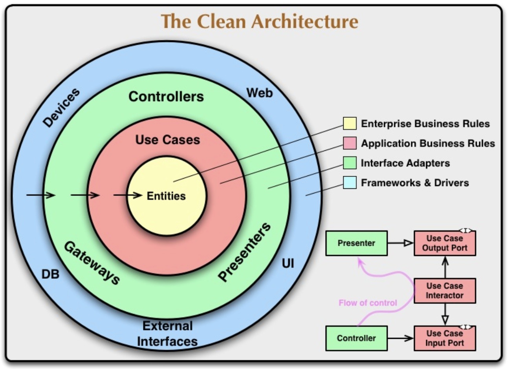
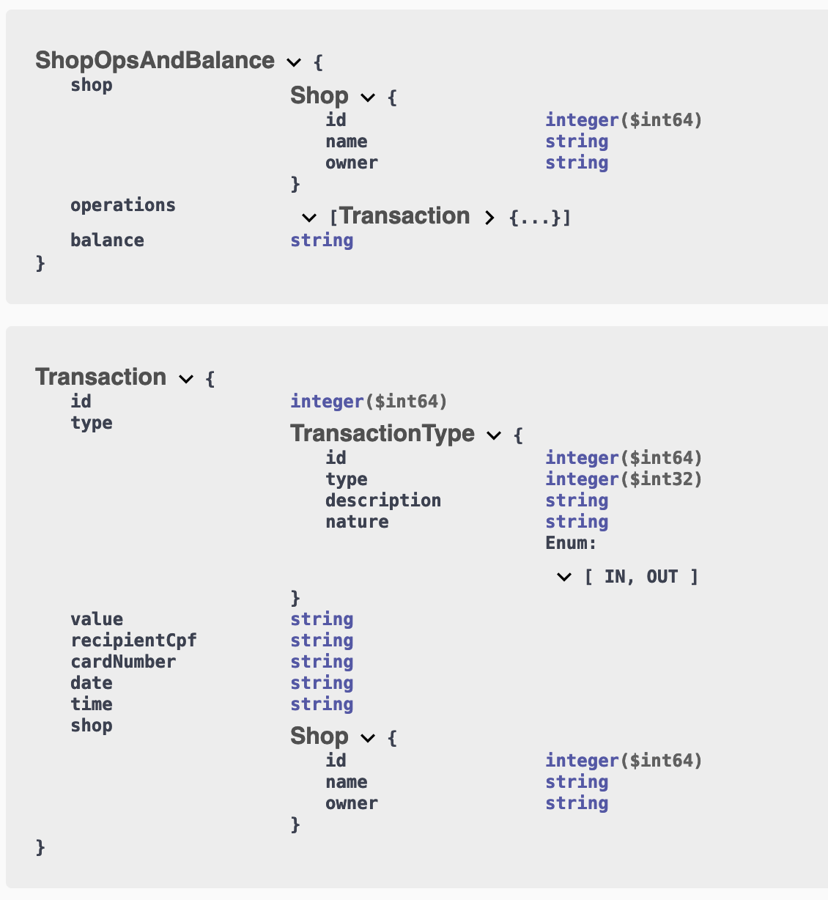

# Load CNAB file

This application parses and loads a file in the CNAB (Centro Nacional de Automacao Bancaria) format. The parsed data can be retrieved via RESTful API.

## Architecture
The application is organised as per the **Clean Architecture** pattern, with the services in the `usecase` package and the `controller` and `persistence` layers living in their own packages under the `adapter` package. I haven't felt the need to create any *domain objects* so far but, in the future, they should live in the `domain` package and have no reference to other objects. Only use cases will be allowed to reference them as dependencies must only point inwards (**the dependency rule**).  
  
  

## Development

I used TDD to guide my development (red, green, refactor); the `OperationManagerTest.java` class contains all my unit tests. I have mocked up database accesses to allow for tests to run fast. After all, they are unit tests!

## Acceptance tests

If we are practising Continuous Delivery, we must have all our tests automated. I followed the BDD style without using any external framework for the sake of simplicity. The test case has been defined by following the API expected behaviour.
All acceptance tests are in the `AppTest.java` class.


## Architectural decisions
1. I have adopted the **Clean Architecture pattern** to allow the application to grow without sacrificing maintainability. Different concerns are kept separate in different layers.
1. The main service, `OperationManager.java`, is completely testable in isolation due to the use of Dependency Injection.
1. The outer layers, `controller` and `persistence`, can be swapped out without affecting the inner layer: `usecases`.
1. To exemplify the previous point, leveraging the Spring Boot capabilities, I have built the persistence layer to support two different databases: (in-memory) H2 and MySQL.
1. Security has not been implemented for simplicity's sake  although it would be required in a real-life application. I'd use Spring Security to do so.

## API documentation (OpenAPI)

I have included the `springdoc-openapi-ui` dependency in the project which automatically renders a HTML page containing the OpenAPI v3 documentation for all endpoints exposed via *Spring Boot Controllers*. As per my experience, automatically generated documentation is the only viable way to keep it up to date.
  
With the application running, point your browser at `http://localhost:8080/swagger-ui.html`
  
  
  
  
## How to test and run the application

- To run the unit tests locally, go to the `.\cnab-app` folder and enter: 
`mvn test`

- To run the application locally using the embedded in-memory database, go to the `.\cnab-app` folder and enter:
  ```  
  mvn package
  java -jar target/cnab-app-1.0-SNAPSHOT.jar
  ```
  The application will be available at the port **8080**.  
    
  You can select the `CNAB.txt` file in the project root folder and click on the `Upload` button. The file content will be parsed and stored on the in-memory database. A successful message should appear at the top of the home page.  
    
  You can inspect the in-memory database pointing your browser at `localhost:8080/h2`.  
    
  You can retrieve the list of transactions with their balance per shop calling the  `localhost:8080/cnab/v1/operations` HTTP GET endpoint. 

  
- To build and run both the application and MySQL containers, go to the *project root* folder and enter:  
  `make docker-up`  
  
  *N.B. You need to have Docker installed on you machine*  
  The makefile will start a Maven container to build the application container using **multi-stage building** so that the final app container does not contain building tools. It will then spin up two containers: *app* and *database*. The application is going to connect to the MySQL database this time.  
  To verify the containers running, type `docker ps`
    
  The application will be available at the port **8080** again.  
  
  The MySQL database running in its container can be accessed through the user *user* with password *password*. For example, if you have MySQL client installed on your machine, use:  
  `mysql -u user -ppassword -h 127.0.0.1 database`

- To shut down both containers, go to the *project root* folder and enter:  
`make docker-down`  


